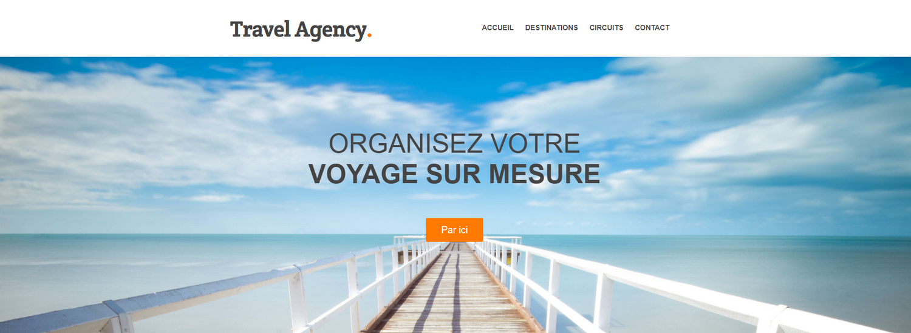
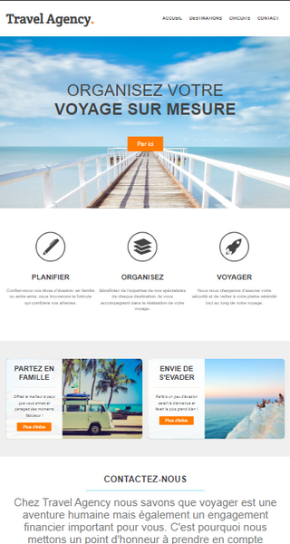

# Travel-agency
 Exemple de présentation d'un site pour une agence de voyage.

## Détails
Utilisation de HTML et de CSS.

## Aperçu
Aperçu de la page d'accueil 

Aperçu de la page d'accueil - version mobile

## Auteur
Virginie Evrard, août 2022

## Remerciements
J'ai réalisé ce site en suivant les explications d'un cours sur Udémy. 
Merci à l'auteur John Taieb, pour sa formation : Formation Complète Développeur Web,
qui m'auras permis d'améliorer mes compétences en programmation HTML et CSS.

